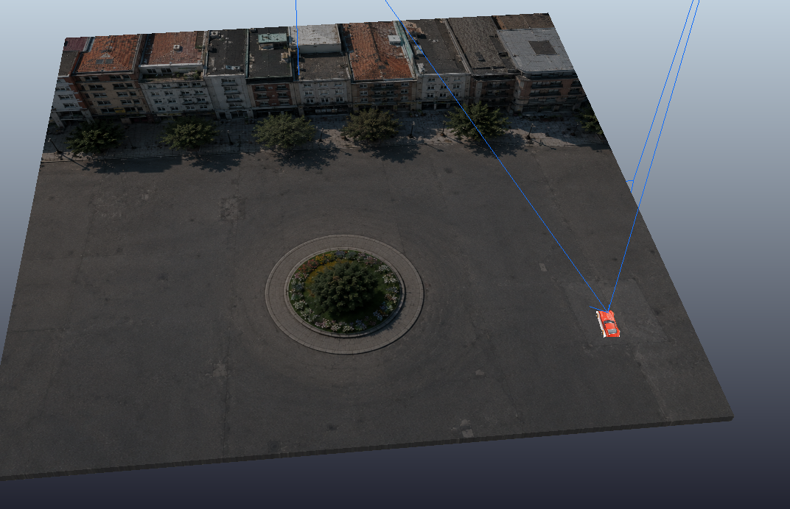
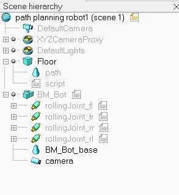

# SNN Path Following
### Bio-inspired Trail Following with CoppeliaSim, OpenCV and Spiking Neural Networks

Implementation of a bio-inspired trail-following behavior in a simulated mobile robot using a Spiking Neural Network (SNN).

The project reproduces, in an abstract computational form, the trail-following behavior of ants. A simulated robot observes an artificial red trail through a camera, processes the visual information and uses a Spiking Neural Network to estimate the lateral position of the trail and control its movement.

The simulation is developed in **CoppeliaSim 4.10**, while the neural network, dataset generation, training, inference and evaluation are implemented in **Python**, using **PyTorch** and **snnTorch**.



---

## 1. Project Overview

The complete pipeline is:

```text
                 CoppeliaSim
                     │
                     ▼
                   Camera
                     │
                     ▼
                 RGB Image
                     │
          ┌──────────┴──────────┐
          │                     │
          ▼                     ▼
       OpenCV                  SNN
      Teacher               Controller
          │                     │
          ▼                     ▼
       Dataset            Trail Position
          │                     │
          └──────────┐   ┌──────┘
                     ▼   ▼
                 Robot Control
                     │
                     ▼
                   Wheels
```

OpenCV is used during dataset generation as a **teacher**: it detects the red trail and assigns one of five positional labels.

The SNN is then trained directly on the RGB camera images and learns to predict the trail position.

During final inference, OpenCV is not required for the SNN decision.

---

## 2. Bio-inspired Motivation

The biological inspiration comes from the **trail-following behavior of ants**.

The project abstracts this behavior into:

```text
Perception → Processing → Decision → Movement
```

and maps it to:

```text
Camera → RGB image → SNN → Trail position → Robot movement
```

The red trail used in the simulation is an artificial representation of a biological trail. It is not a physical pheromone model.

The bio-inspiration concerns both:

- the target behavior;
- the temporal, spike-based neural computation.

---

## 3. Main Objectives

The project aims to:

1. Create a simulated environment for trail following.
2. Generate training data automatically using a conventional computer-vision teacher.
3. Train a Spiking Neural Network to estimate the trail position.
4. Use the trained SNN to control the robot.
5. Evaluate the resulting behavior quantitatively.

---

## 4. Technologies

| Technology | Role |
|---|---|
| CoppeliaSim 4.10 | Robot and environment simulation |
| Python | Main programming language |
| PyTorch | Neural-network framework |
| snnTorch | Spiking Neural Network implementation |
| OpenCV | Computer vision and dataset teacher |
| NumPy | Numerical processing |
| ZeroMQ Remote API | Python/CoppeliaSim communication |
| CSV | Dataset and evaluation data |

---

## 5. Repository Structure

```text
snn-path-following/
│
├── README.md
├── requirements.txt
├── .gitignore
├── LICENSE
├── CITATION.cff
│
├── simulation/
│   ├── path_planning_robot1.ttt
│   ├── path_generator.lua
│   └── README.md
│
├── src/
│   ├── task_zmq_curve.py
│   ├── collect_snn_dataset.py
│   ├── snn_model.py
│   ├── train_snn.py
│   ├── run_snn_robot.py
│   └── evaluate_snn.py
│
├── dataset_snn/
│   └── README.md
│
├── models/
│   └── path_snn.pth
│
├── results/
│   ├── snn_evaluation.csv
│   └── README.md
│
├── assets/
│   ├── scene_overview.png
│   ├── scene_hierarchy.png
│   └── README.md
│
└── docs/
    ├── Tesina_Robotica_Bioispirata.pdf
    └── Presentazione_Robotica_Bioispirata.pptx
```

---

## 6. Simulation Environment

The robot is simulated in **CoppeliaSim 4.10**.

The scene contains:

- a mobile robot named `BM_Bot`;
- a vision camera;
- four wheel joints;
- a large floor;
- a textured urban environment;
- an artificial red trail;
- a Lua child script for procedural trail generation.

### Scene hierarchy

```text
Scene
│
├── DefaultCamera
├── XYZCameraProxy
├── DefaultLights
│
├── Floor
│   ├── path
│   └── script
│
└── BM_Bot
    ├── rollingJoint_fl
    ├── rollingJoint_fr
    ├── rollingJoint_rr
    ├── rollingJoint_rl
    ├── BM_Bot_base
    └── camera
```



Expected object names:

```text
/camera
/rollingJoint_fl
/rollingJoint_rl
/rollingJoint_rr
/rollingJoint_fr
```

The Python programs use these names to access the camera and wheel joints.

---

## 7. Procedural Trail Generation

The CoppeliaSim scene contains a non-threaded Lua child script attached to the Floor.

The script:

1. hides the original path;
2. obtains the current robot position;
3. generates a new closed trail;
4. deforms an approximately elliptical base path;
5. creates 96 path points;
6. represents the path using red static segments;
7. closes the trail by connecting the last segment to the first;
8. regenerates a new path after a complete loop.

Conceptually:

```text
Base ellipse
     │
     ▼
Random harmonic deformation
     │
     ▼
96 path points
     │
     ▼
Red trail segments
     │
     ▼
Closed loop
```

The corresponding script is:

```text
simulation/path_generator.lua
```

---

## 8. Communication with CoppeliaSim

Python communicates with CoppeliaSim through the **ZeroMQ Remote API**.

The project uses:

```python
from coppeliasim_zmqremoteapi_client import RemoteAPIClient

client = RemoteAPIClient()
sim = client.require("sim")
```

The Python programs can:

- start and stop the simulation;
- acquire camera frames;
- retrieve robot objects;
- access wheel joints;
- set wheel target velocities.

---

## 9. OpenCV Teacher

OpenCV provides the supervision used to create the SNN dataset.

The processing pipeline is:

```text
RGB image
    │
    ▼
RGB → HSV
    │
    ▼
Red mask
    │
    ▼
Morphological filtering
    │
    ▼
Contours
    │
    ▼
Largest valid contour
    │
    ▼
Trail centroid
    │
    ▼
Position class
```

The detected trail centroid is used to determine the horizontal position of the trail in the camera image.

OpenCV is therefore a **teacher**, not the final SNN controller.

---

## 10. Five Position Classes

| Class | Name | Meaning |
|---:|---|---|
| 0 | FAR_LEFT | Trail far to the left |
| 1 | LEFT | Trail to the left |
| 2 | CENTER | Trail approximately centered |
| 3 | RIGHT | Trail to the right |
| 4 | FAR_RIGHT | Trail far to the right |

The normalized horizontal coordinate is:

```text
x_norm = cx / image_width
```

with:

```text
x < 0.20       → FAR_LEFT
0.20–0.40      → LEFT
0.40–0.60      → CENTER
0.60–0.80      → RIGHT
x > 0.80       → FAR_RIGHT
```

---

## 11. Dataset Generation

Generate the dataset with:

```bash
python src/collect_snn_dataset.py
```

The script:

1. connects to CoppeliaSim;
2. starts the simulation;
3. reads the camera;
4. detects the red trail;
5. calculates its centroid;
6. assigns a class;
7. saves the RGB image;
8. writes the corresponding label to CSV.

The default target is:

```text
3000 samples
```

The generated dataset is stored in:

```text
dataset_snn/
├── images/
└── labels.csv
```

The full dataset is intentionally not included in this repository because it can contain thousands of image files. It can be regenerated from the simulation.

---

## 12. Spiking Neural Network

The SNN is implemented with PyTorch and snnTorch.

Architecture:

```text
RGB image
32 × 32 × 3
      │
      ▼
Flatten
      │
      ▼
Linear 3072 → 128
      │
      ▼
LIF β = 0.9
      │
      ▼
Linear 128 → 5
      │
      ▼
LIF
      │
      ▼
5 output classes
```

The network is intentionally shallow and fully connected.

---

## 13. Rate Coding

Input pixels are converted into spike trains using rate coding.

```text
Pixel intensity
      │
      ▼
Rate coding
      │
      ▼
Spike train
      │
      ▼
20 timesteps
```

The network therefore processes the input over time rather than treating the image as a single static activation.

---

## 14. Training

Train the SNN with:

```bash
python src/train_snn.py
```

Main parameters:

| Parameter | Value |
|---|---:|
| Input | 32 × 32 RGB |
| Input features | 3072 |
| Hidden neurons | 128 |
| Output classes | 5 |
| LIF beta | 0.9 |
| Timesteps | 20 |
| Batch size | 32 |
| Epochs | 20 |
| Learning rate | 0.001 |
| Optimizer | Adam |
| Loss | Cross Entropy |
| Validation split | 20% |

The training uses a surrogate gradient for the non-differentiable spike function.

The best checkpoint is saved to:

```text
models/path_snn.pth
```

---

## 15. SNN Inference

During inference:

```text
Camera
   │
   ▼
RGB image
   │
   ▼
Preprocessing
   │
   ▼
Rate coding
   │
   ▼
SNN — 20 timesteps
   │
   ▼
Membrane potential
   │
   ▼
Softmax
   │
   ▼
5 class probabilities
```

The class probabilities are then converted into a continuous lateral position.

---

## 16. Continuous Position

The five classes are associated with:

```text
FAR_LEFT   = -1.0
LEFT       = -0.5
CENTER     =  0.0
RIGHT      = +0.5
FAR_RIGHT  = +1.0
```

The controller calculates:

```text
position = Σ p_i · position_i
```

where `p_i` is the probability associated with class `i`.

This produces a smoother control variable than simply using the most probable class.

---

## 17. Temporal Smoothing

Recent position estimates are stored in a history buffer.

A smoothing operation is applied before the steering command is generated.

```text
SNN
 │
 ▼
Position
 │
 ▼
5-prediction history
 │
 ▼
Smoothed position
 │
 ▼
Steering
```

This reduces abrupt changes caused by individual noisy predictions.

---

## 18. Robot Control

The smoothed position controls the robot rotation.

The controller uses approximately:

```text
rotation = -3.0 × position
```

with saturation at:

```text
±4.5
```

The forward speed is reduced when the estimated lateral error becomes larger.

This results in:

```text
Small error
→ higher forward speed
→ small correction
```

and:

```text
Large error
→ lower forward speed
→ stronger correction
```

The controller then converts the forward and rotational commands into target velocities for the four wheel joints.

---

## 19. Run the Trained Robot

After training, run:

```bash
python src/run_snn_robot.py
```

The program loads:

```text
models/path_snn.pth
```

and starts the SNN controller.

Press:

```text
q
```

to stop the visual interface.

---

## 20. Evaluation

Run:

```bash
python src/evaluate_snn.py
```

The evaluation data are stored in:

```text
results/snn_evaluation.csv
```

The evaluation includes information such as:

- predicted class;
- confidence;
- continuous position;
- camera-based trail error;
- rotation;
- timing information.

The CSV-based off-track estimate is an image-based proxy and should not be interpreted as a world-space distance in meters.

---

## 21. Reported Results

The aggregate results reported in the academic presentation are:

| Metric | Result |
|---|---:|
| Success rate | **96.93%** |
| Mean lateral error | **0.187** |
| Mean completion time | **61.52 s** |
| Off-track estimate | **3.07%** |
| Recovery time | **1.16 s** |
| Computation | **9.48 FPS** |

The repository also contains the complete CSV generated by the evaluation script:

```text
results/snn_evaluation.csv
```

A summary of that CSV is available in:

```text
results/README.md
```

---

## 22. OpenCV vs SNN

| Aspect | OpenCV | SNN |
|---|---|---|
| Input | RGB camera | RGB camera |
| Processing | HSV + contours | Rate coding + LIF |
| Training | Not required | Supervised |
| Labels | Generates labels | Predicts labels |
| Temporal dynamics | Frame-based | 20 timesteps |
| Final controller | Teacher / baseline | Final controller |
| Bio-inspired computation | No | Yes |

The central design idea is:

```text
OpenCV
   │
   ▼
Teacher
   │
   ▼
Dataset
   │
   ▼
SNN
   │
   ▼
Robot Controller
```

---

## 23. Installation

Clone the repository:

```bash
git clone https://github.com/YOUR_USERNAME/snn-path-following.git
cd snn-path-following
```

Create a virtual environment.

### Windows

```bash
python -m venv .venv
.venv\Scripts\activate
```

### Linux / macOS

```bash
python3 -m venv .venv
source .venv/bin/activate
```

Install Python dependencies:

```bash
pip install -r requirements.txt
```

CoppeliaSim must be installed separately.

---

## 24. Complete Experiment

### Step 1 — Open CoppeliaSim

Open:

```text
simulation/path_planning_robot1.ttt
```

### Step 2 — Generate the dataset

```bash
python src/collect_snn_dataset.py
```

### Step 3 — Train

```bash
python src/train_snn.py
```

### Step 4 — Run the SNN controller

```bash
python src/run_snn_robot.py
```

### Step 5 — Evaluate

```bash
python src/evaluate_snn.py
```

---

## 25. Limitations

The current implementation has several limitations:

- experiments are performed only in simulation;
- the trail is artificial and represented by color;
- the dataset depends on OpenCV-generated labels;
- the SNN is shallow and fully connected;
- the evaluation environment is controlled;
- no real-world robot experiment has been performed;
- no energy-consumption measurement has been performed;
- no neuromorphic hardware implementation has been tested.

Therefore, the reported performance should be interpreted as performance of the proposed simulated system rather than as a general real-world navigation result.

---

## 26. Future Work

Possible future developments include:

- transfer to a physical mobile robot;
- event-based cameras;
- event-driven visual processing;
- convolutional SNN architectures;
- larger and more diverse datasets;
- different lighting conditions;
- trail occlusions;
- obstacles;
- comparison with conventional neural networks;
- online learning;
- reinforcement learning;
- neuromorphic hardware;
- swarm robotics.

---

## 27. Academic Documentation

The repository contains the documentation used for the academic project:

- [Project thesis](docs/Tesina_Robotica_Bioispirata.pdf)
- [Project presentation](docs/Presentazione_Robotica_Bioispirata.pptx)

The thesis describes the motivation, simulation environment, OpenCV teacher, dataset, SNN architecture, training, controller, evaluation and future developments.

---

## 28. Author

**Claudio Giacobbe**

University of Messina  
Department of Engineering  
Bioengineering — LM-21

Course: **Bio-inspired Robotics**

Project:

**Implementation of a Bio-inspired Trail-Following Behavior using a Spiking Neural Network**

---

## 29. Academic / Educational Use

This repository was developed as an academic project for the Bio-inspired Robotics course.

The implementation is intended for educational, research and demonstration purposes.
